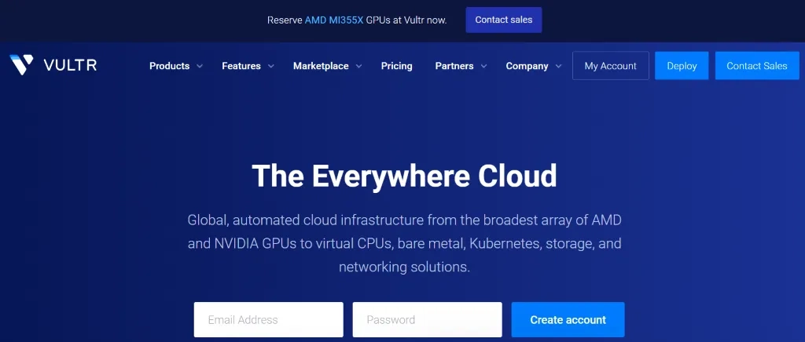

# Vultr Cloud Servers: Flexible Hourly Billing for Easy Testing

---

Looking at overseas cloud servers for the first time? You're probably wondering which provider won't eat your budget during the learning phase. Most VPS services lock you into monthly plans—buy it, realize it's wrong for you, and the money's already gone. That's where **Vultr's hourly billing** changes everything: spin up a server, test for two hours, delete it, and only pay for those two hours. No commitment anxiety, no wasted subscriptions.

---

## What Makes Vultr Different

Vultr launched in 2014 and quickly built a loyal user base by doing one thing exceptionally well: making cloud infrastructure accessible. While older providers were stuck in enterprise-only territory, Vultr designed their platform for everyone—from someone learning Linux basics to teams running production apps.

### Product Range

Their lineup covers pretty much everything you'd need:

- **Cloud Compute**: Standard VPS instances with various configurations
- **Dedicated Cloud**: Full resource allocation for consistent performance
- **Bare Metal**: Physical servers with no virtualization overhead
- **GPU Servers**: Purpose-built for AI and machine learning workloads

They've also got managed databases, object storage, and CDN services. The practical advantage? You can start with a basic VPS for your blog, then add database hosting or CDN without switching providers as your project grows.

### Global Network

With data centers in 31 locations worldwide, Vultr gives you real deployment flexibility. Whether your users are in São Paulo, Singapore, or Stockholm, you can pick a nearby server location. Closer servers mean lower latency and faster page loads—your site just feels snappier to visitors.

### Payment Options

For users anywhere in the world, Vultr makes it easy to get started:

- **Alipay**: Convenient for users in China
- **Credit Cards**: Visa, MasterCard, and other major cards
- **PayPal**: International standard
- **Bank Transfer**: For larger accounts or enterprise arrangements
- **Cryptocurrency**: Bitcoin and other digital currencies accepted

The variety removes payment friction completely. Whether you prefer local payment methods or international platforms, you're covered.

## Why Vultr Works for Real Projects

### Hourly Billing That Actually Matters

This isn't just a billing feature—it fundamentally changes how you can use cloud servers. Want to test if your app runs better on 2GB or 4GB of RAM? Create both, run your benchmarks, delete the slower one. Total cost? Maybe a dollar. 

Traditional monthly billing makes these experiments expensive. Vultr's approach means you can actually *learn* through trial and error without fear of the bill.

### Pick Your Location Strategically

Those 31 data center locations aren't just numbers—they're practical options for where your server lives. Building a site for Southeast Asian customers? Singapore gives you solid performance. European audience? Try London or Amsterdam. The choice directly affects your users' experience.

And here's something useful: if you're testing which location works best for your audience, the hourly billing means you can literally spin up servers in three different regions, test them all weekend, and shut down the losers. Maybe fifteen bucks spent, invaluable data gained.

### Deploy in Minutes, Not Hours

When Vultr says "fast deployment," they mean it. Order a server, grab a coffee, come back to a running instance. This speed matters more than you'd think—especially when you're learning and need to restart fresh after breaking something (we've all done it).

### Pricing That Makes Sense

Vultr's entry-level pricing sits around $3.50-5.00 per month for basic configurations. That's genuinely affordable for personal projects or learning. And because you can delete and recreate servers freely with hourly billing, you're never locked into paying for unused capacity.

The pricing scales logically too. Need more resources? Upgrade and pay proportionally more. Need less? Scale down. No weird pricing jumps or hidden fees.

### Actually Usable Interface

Some cloud providers seem to think complexity equals sophistication. Vultr went the opposite direction—their dashboard shows you what you need, where you'd expect it. Create a server, manage backups, check billing: all straightforward.

When you're new to cloud servers, wrestling with a confusing interface wastes time you could spend learning actual server administration. Vultr's clean design keeps the focus where it belongs.

### Snapshot Backups

Before you install that new software package or edit that critical config file, take a snapshot. It's basically a save point for your entire server. If something breaks, restore the snapshot and you're back to working state in minutes.

Snapshots are billed by storage size, not per-snapshot, so the cost stays reasonable. For anyone learning server administration, this safety net is worth its weight in gold—or at least worth avoiding hours of reconfiguration work.

### DDoS Protection Available

Vultr offers professional DDoS protection as a paid add-on. If you're running anything that handles real user traffic or transactions, this protection prevents your service from getting knocked offline by attacks. 

The cost is reasonable compared to the potential revenue loss from downtime. Think of it as insurance for your online presence.

## Configuration Options

Vultr's shared CPU plans start at affordable entry points and scale up to powerful configurations. Whether you need a simple server for learning or something beefier for production apps, there's likely a fit.

The $5/month tier (1 CPU core, 1GB RAM, 25GB SSD, 1TB transfer) handles personal blogs, learning environments, and small applications without breaking a sweat. It's honestly the sweet spot for getting started.

Looking at something more demanding? Vultr scales all the way up to 24-core processors with 96GB of RAM. Storage comes in SSD or NVMe options—NVMe being notably faster for database-heavy applications.

👉 [Check current pricing and configurations—they update based on capacity and region](https://www.vultr.com/?ref=9738262-9J)

The dedicated CPU plans offer guaranteed resources with no sharing. Your CPU cores are yours alone, which means consistent performance under load. This matters for databases, high-traffic sites, or computation-intensive work.

If even dedicated instances don't cut it, Vultr's bare metal servers give you an entire physical machine. No virtualization layer, no resource sharing—just raw hardware performance.

## Who Should Use Vultr

### Beginners Learning Server Administration

If you're new to cloud servers, Vultr removes most of the financial stress from learning. Hourly billing means mistakes cost pennies, not dollars. Break your server configuration? Delete it, start fresh, total cost: maybe 50 cents.

The interface won't confuse you, documentation is clear, and basic configurations are genuinely basic. You can focus on learning Linux, web servers, and databases instead of wrestling with the platform itself.

### Individual Developers and Side Projects

When you're building something new, you don't know if it'll need 1GB or 4GB of RAM until you try. Vultr's flexibility means you can experiment with configurations as your project develops. Test environment on weekdays, shut it down on weekends—pay only for usage.

Personal portfolio sites, development blogs, or demo environments for GitHub projects all run happily on Vultr's affordable entry tiers.

### Startups and Small Teams

Early-stage companies need to conserve cash while maintaining reliable infrastructure. Vultr's pay-as-you-go model helps control costs during unpredictable growth phases. Scale up when traffic increases, scale down during quiet periods.

The global data centers also help if you're testing international markets—deploy in different regions without committing to long-term contracts.

### International Business Operations

Serving customers across multiple countries? Deploy servers close to each market. A Tokyo server for Japanese customers, a London server for European users, and a New York server for Americans. 

When you're deploying globally, hourly billing for initial testing becomes crucial. You can determine which regions actually need infrastructure before committing resources.

### Content Creators Building Platforms

Running your own website means owning your audience relationship instead of renting it from social platforms. Vultr gives you the infrastructure to build that independent presence without enterprise-level costs.

Whether it's a blog, community forum, or membership site, basic Vultr configurations handle typical content creator needs just fine.

## New User Opportunity

Vultr currently offers new users **$300 in credits** valid for 30 days after account verification with a credit card or PayPal. This gives commercial users a solid month to evaluate the service across different configurations and regions without financial commitment.

If you're considering Vultr for a business application, this trial period lets you stress-test everything: performance, support responsiveness, network quality, and whether the platform fits your workflow.

## Questions People Actually Ask

**What if my IP gets blocked in China?**

Some Vultr IPs do face access restrictions in mainland China. If you encounter this, delete the server and create a new one—you'll usually get a different IP. Asian locations like Tokyo or Singapore generally have better accessibility. Using Cloudflare CDN also helps with access stability.

**What configuration should beginners start with?**

Start with 1 vCPU, 1GB RAM, 25GB storage (the $5/month tier). Choose Ubuntu 22.04 LTS as your operating system—it has the best documentation and community support for newcomers. Pick Tokyo or Singapore for location if you're in Asia, or whatever region is closest to your users.

This configuration handles learning, personal blogs, and small applications while staying affordable.

**Can I upgrade or downgrade later?**

Upgrading works smoothly—increase CPU, RAM, or storage through the dashboard with a quick restart. Downgrading requires more work: create a new smaller instance and migrate your data manually. Storage can expand but not shrink.

Start small and scale up as needed. The hourly billing makes this low-risk.

**How secure are Vultr servers?**

Vultr provides basic security (firewall, DDoS detection), but you're responsible for server-level security. At minimum: change default SSH ports, use key-based authentication instead of passwords, keep your system updated, and configure firewall rules properly.

Professional DDoS protection is available as a paid add-on if you're running commercial services that might attract attacks.

---

## Bottom Line

Vultr succeeds by making cloud infrastructure genuinely accessible. The hourly billing removes financial anxiety from learning and testing. The global network gives you deployment flexibility. The straightforward interface doesn't waste your time.

Whether you're learning server administration for the first time, building a side project, or running a small business, Vultr provides the infrastructure without forcing you into rigid monthly commitments or enterprise complexity. You use what you need, pay for what you use, and can experiment freely.

👉 [Start with Vultr's infrastructure—the flexibility might change how you think about cloud servers](https://www.vultr.com/?ref=9738262-9J)
